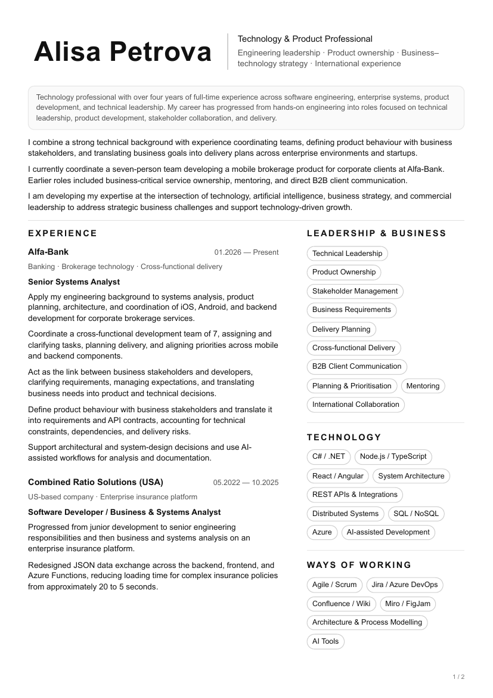
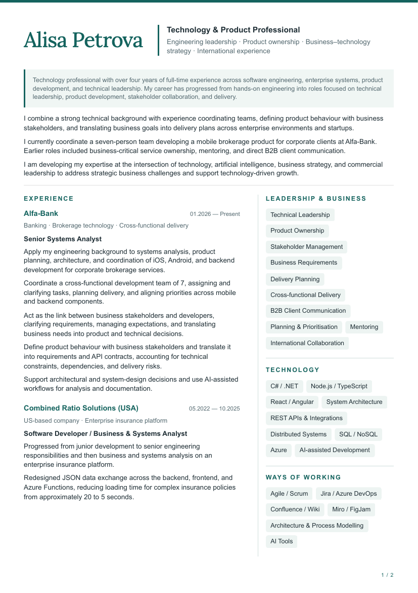

# Your CV, without the formatting fight

A CV you can read, edit, keep in Git, and turn into a PDF. Start with one HTML
file. Move to separate content and styles whenever that becomes useful.

## Just want to try it? Start here.

Not in the mood to figure out the folder structure? Fair enough. You don't need
to. Grab these two files, give them to your favourite AI assistant along with
your experience, and see what comes back:

1. **[The blank template](Single%20file%20template%20-%20your%20CV/cv.html)** — this becomes your CV.
2. **[My example](Single%20file%20example%20-%20Alisa%20Petrova%20CV/cv.html)** — this shows the layout and the level of detail.

On GitHub, open each file and use **Download raw file**, or download the repository
with **Code → Download ZIP**. Attach both HTML files to your assistant. Add your
existing CV, work history, or rough notes, and paste this:

```text
I have attached an HTML CV template and a completed example.
Please use the template to organise MY experience in the same way.
Use the example for layout, writing style, and level of detail only.
Do not copy the example person's name, contacts, employers, achievements,
dates, qualifications, or metrics into my CV.

My target role or programme: [paste here]
The job description, if available: [paste here]
My experience, education, skills, and contacts: [paste here or use my attachment]

Preserve the template's visual design and sensible page breaks. Write clear,
specific descriptions of my own contributions. Keep official job titles and
employment dates accurate. Do not invent results, numbers, or qualifications.
Ask me about important missing facts before producing the final version.
Remove unused placeholder sections rather than filling them with made-up facts.

Return one complete HTML file named my-cv.html, with all CSS inside it.
It must open locally in a browser without a server or internet connection.
Keep the document readable and check the A4 print layout. If my experience
doesn't fit the two-page layout, suggest what to shorten or move instead of
clipping content or making the text tiny.
```

Save the result as `my-cv.html` and double-click it. That's it: no terminal, no
Node.js, no setup. You can ask the assistant to adjust the wording, colours,
spacing, or skill badges and return an updated complete file.

**Want a PDF?** Open the HTML in Chrome or Edge, press **Ctrl+P** (Windows/Linux)
or **Cmd+P** (macOS), choose **Save as PDF**, select **A4**, set margins to **None**,
keep scale at **100%**, turn browser **Headers and footers off**, and enable
**Background graphics** for the coloured theme. Check every page in the preview
before saving. The supplied layouts already contain their own margins and page
numbers. [More printing help](docs/PRINTING.md).

The unchanged original example needs **99% scale** in the tested Chrome version
to stay on two pages. Your template and the structured exports use **100%**.

## Just browsing? Here are the PDFs.

You can view these directly on GitHub before downloading or editing anything:

| Example | Classic PDF | Editorial PDF |
| --- | --- | --- |
| Original single-file CV | [Original PDF](Single%20file%20example%20-%20Alisa%20Petrova%20CV/cv.pdf) | — |
| MBA / technology and product leadership | [Classic](Structured%20CV%20example%20-%20Alisa%20Petrova/exports/mba-classic.pdf) | [Editorial](Structured%20CV%20example%20-%20Alisa%20Petrova/exports/mba-editorial.pdf) |
| Team Lead / engineering leadership | [Classic](Structured%20CV%20example%20-%20Alisa%20Petrova/exports/team-lead-classic.pdf) | [Editorial](Structured%20CV%20example%20-%20Alisa%20Petrova/exports/team-lead-editorial.pdf) |

These are finished examples. PDF files are snapshots and are not automatically
refreshed by the HTML builder; print an updated PDF after changing your CV.

## Prefer a CV you can keep building on?

The structured version separates your experience from its presentation. Change
a role heading for an application, choose which aspects of your experience to
emphasise, and try a different visual style without rewriting everything.

| Start with | Use it for |
| --- | --- |
| [Single file example - Alisa Petrova CV](Single%20file%20example%20-%20Alisa%20Petrova%20CV) | The original 3 October 2026 CV, preserved unchanged. |
| [Single file template - your CV](Single%20file%20template%20-%20your%20CV) | The quickest way to make your own CV with an AI assistant. |
| [Structured CV example - Alisa Petrova](Structured%20CV%20example%20-%20Alisa%20Petrova) | A complete example with two profiles and two styles. |
| [Structured CV template](Structured%20CV%20template) | The same structure with clearly marked placeholders for your own facts. |

The single-file folders are independent: each `cv.html` contains its own styles.
You can send that file through a messenger or move it to another laptop.

The structured folders are working projects. Keep the repository's `build.mjs`
and `lib/` alongside them when building. Once exported, the resulting HTML is
independent too, including any font used by its theme.

## Two styles, the same experience

| Classic | Editorial |
| --- | --- |
| Monochrome, two columns, rounded skill badges; based on the original CV. | Teal accents, a Lora serif name, a separated sidebar, and square badges. |
|  |  |
| [Open the complete HTML](Structured%20CV%20example%20-%20Alisa%20Petrova/exports/mba-classic.html) | [Open the complete HTML](Structured%20CV%20example%20-%20Alisa%20Petrova/exports/mba-editorial.html) |

GitHub shows HTML source rather than rendering a CV. Download the file to view it.

The paper stays light in both browser colour schemes; the surrounding canvas and
scrollbars adapt to dark mode. On narrow screens the structured exports stack
the columns for reading. Printing still uses the two-column A4 layout.

## What's inside a structured folder?

```text
Structured CV template/
├── cv.html                       # Change the target-role headline here
├── content/
│   ├── person.json               # Name, contacts, work format
│   ├── education.json
│   ├── languages.json
│   ├── experience/
│   │   ├── recent-role.json      # One employer/engagement per file
│   │   ├── previous-role.json
│   │   └── ...
│   └── profiles/
│       ├── mba.json              # Business/product/leadership emphasis
│       └── team-lead.json        # Engineering/team-lead emphasis
├── layout/
│   └── two-pages.html            # Page structure and content slots
├── styles/
│   ├── base.css                  # Shared layout, print and mobile rules
│   ├── classic.css               # Original monochrome appearance
│   └── editorial.css             # Alternate visual theme
├── fonts/
│   ├── Lora-Variable.ttf
│   ├── OFL.txt                   # Font license
│   └── README.md
└── exports/                      # Complete HTML files, ready to open/share
```

**Everyday edit:** change the text inside `<h1 data-cv-headline>` in `cv.html`.
That's the only CV content you normally edit in that HTML file. For example:

```html
<h1 data-cv-headline>Engineering Team Lead</h1>
```

Write an ampersand as `&amp;` in HTML. Keep the element and build markers intact.
Opening the source `cv.html` shows an editing hint; **open a file in `exports/`
to preview the complete CV**. Rebuild after editing the source.

**New facts:** edit `content/`, not the layout. JSON strings are plain text; the
builder escapes them as HTML. Keep valid JSON: double quotes, commas between
items, and no trailing commas or comments.

## Profiles: change the emphasis, keep the facts

The example's `mba` profile preserves the original CV's wording and reading
order. It suits the technology/product/leadership framing used for an MBA
application; it does not claim that an MBA has already been completed.

The `team-lead` profile gives existing coordination, architecture, and mentoring
paragraphs earlier positions. It changes the presentation, not historical job
titles. Both profiles include every original experience paragraph exactly once.

Each experience file contains shared facts plus paragraph selections:

```json
{
  "company": "[Employer]",
  "period": "[Dates]",
  "parts": {
    "main": { "position": "[Official title]", "meta": "[Context]" }
  },
  "paragraphs": [
    "[First verified achievement]",
    "[Another verified achievement]"
  ],
  "variants": {
    "mba": { "main": [0, 1] },
    "team-lead": { "main": [1, 0] }
  }
}
```

The numbers are paragraph positions, starting at **0**. You can also add
alternative truthful descriptions to `paragraphs` and select different ones for
each profile. Review the facts when doing so. Adding/removing paragraphs means
updating these index lists too. The supplied example only reorders existing text.

Profile files choose summary paragraphs, skill groups, the experience order, and
which parts go on each page. The longer previous role demonstrates `intro` and
`continued` parts across pages. Rename or remove unused jobs in your template,
then update the selections in both profiles.

The headline is independent of the profile: choosing `team-lead` does not silently
overwrite the headline you typed in `cv.html`. `suggestedHeadline` is used only
when rebuilding the preset gallery with `--all`.

## Build one complete HTML file

Install [Node.js](https://nodejs.org/en/download) **22 or newer** if you want to
use the structured builder. There are no npm packages to install.

Open a terminal in the repository root, where `build.mjs` lives. Paths containing
spaces need quotes. The same commands work in PowerShell, macOS, and Linux:

```sh
node build.mjs "Structured CV template/cv.html"
```

This uses the headline in that HTML, the `mba` profile, and the `classic` theme.
It writes `Structured CV template/exports/mba-classic.html`.

Choose a different profile and style:

```sh
node build.mjs "Structured CV template/cv.html" --profile team-lead --theme editorial
```

Save an application-specific copy without changing the source headline:

```sh
node build.mjs "Structured CV template/cv.html" --profile team-lead --theme classic --headline "Platform Engineering Lead" --out "exports/company-name.html"
```

You can also duplicate `cv.html` as `company-name.html` **inside the same structured
folder**, change its headline, and pass that file to the builder. It will use the
same adjacent content, layout, and styles.

Rebuild all eight ready-made combinations:

```sh
node build.mjs --all
```

This intentionally uses the profiles' suggested headlines and replaces the
generated gallery files. It does not update either independent single-file CV.
Use the selected-file command for your actual application headline.

The exporter renders the selected content, inlines CSS, embeds referenced local
fonts and their license, and produces passive HTML. **No JavaScript, local server,
CDN, or internet connection is needed to open an export.** Contact links remain
ordinary links; following an online link naturally requires a connection.

Exports are reproducible: the same source/profile/theme/headline produces the same
bytes. The builder rejects unknown references, remote font URLs, unsafe contact
protocols, and source overwrites. It only replaces files marked as its own output.
Each build runs in a worker with a 30-second deadline under a single-run lock.

## Make it look like you

Copy `styles/classic.css` to `styles/my-style.css`, then add overrides:

```css
:root {
  --accent: #7b3654;
  --chip-bg: #faf0f4;
  --chip-border: #e8d1dc;
}
.section h2, .name { color: var(--accent); }
.chip { border-radius: 4px; }
```

Build with `--theme my-style`. The content stays the same. Keep layout changes
in `base.css` if they should apply to every theme; put appearance changes in the
theme. Shared scrollbar colours use the `--scroll-*` tokens.

For custom fonts, see `fonts/README.md`. The supplied font is stored locally and
used only by Editorial. Classic retains the original system-font treatment.
Changing fonts can change line wrapping, so check the PDF preview again.

## More useful AI prompts

**Update a structured CV**

```text
Work in Structured CV template. Read its content, layout, and style files first.
Replace placeholders with the facts I provide below. Keep factual data in
content/, not in layout or CSS. Keep my official titles and dates accurate.
Update both profiles and their paragraph indices when changing experience.
Do not copy personal facts from the example. Ask about missing facts.
Build my selected HTML with both themes, check every print page, and tell me
which files changed. My information: [paste here]
```

**Tailor the emphasis for an application**

```text
Use my existing facts to tailor the CV to this opportunity: [paste job/programme].
Suggest a target headline and explain which experience you would emphasise.
Keep official past job titles, dates, scope, and metrics unchanged. Do not turn
team coordination into a claim of direct reports. Create a separate application
HTML in the same structured folder and export it to a clearly named output.
```

**Try another visual style**

```text
Create styles/[theme-name].css with this visual direction: [describe it].
Keep all CV content unchanged. Reuse the shared layout and semantic colour
tokens. Preserve readable type, links, mobile reading, and A4 print behaviour.
Use only local fonts with their licenses. Export the same profile with both
the existing theme and the new one, then compare all pages for overflow.
```

## A few things worth knowing

- The supplied layout has **two explicit pages**. It doesn't intelligently fit
  any amount of text. Move roles between pages in the profile, shorten wording,
  or extend the layout when needed. Don't hide overflow to make a page count pass.
- A PDF is a snapshot. Edit the HTML/data source and rebuild when your facts change.
- Single-file and structured templates are separate starting points; they do not
  automatically sync with each other.
- Git records the versions you **commit**. It is not automatic backup for every
  keystroke. [A small Git workflow](docs/MAINTAINING.md).
- Use the output format requested by the recipient. This is a way to maintain a
  CV; it isn't a promise that every hiring portal accepts HTML or every layout.

## Reuse and local checks

The code and templates are available under the [MIT license](LICENSE).
The example is a layout reference, not a set of facts to reuse as your own.
Bundled fonts have their own [OFL notice](Structured%20CV%20template/fonts/OFL.txt).

[Local verification and maintenance](docs/MAINTAINING.md) describes the sequential
check runner, process cleanup, content checks, and optional browser/PDF review.
There are no hosted CI workflows or required services.

See the [acceptance record](docs/ACCEPTANCE.md) for the checked browser, print
settings, source fidelity, and known limits of the supplied examples.
